# The Mythos Class: Understanding Anthropic's New Frontier Model Tier

> A research report on Anthropic's Mythos-class models, the rationale behind the new model tier, Project Glasswing, and the capability threshold that separates Mythos-class systems from previous Claude generations.
---

# Table of Contents

1. Introduction
2. The Claude Model Hierarchy
3. Understanding the Capability Gap
4. Why Anthropic Created Mythos-Class Instead of Opus 5
5. The Fable and Mythos Naming Logic
6. Project Glasswing
7. Mythos Preview and the Road to Mythos 5
8. The Capability Threshold Problem
9. Responsible Scaling Policy (RSP)
10. Timeline of Mythos-Class Development
11. Key Findings
 

---

### Coding Benchmarks and Comparative Evaluations

Anthropic's publicly documented benchmark reporting for Mythos Preview includes SWE-bench Pro (77.8%), Terminal-Bench 2.0 (82.0%), SWE-bench Verified (93.9%), GPQA Diamond (94.6%), and Humanity's Last Exam (56.8% without tools). As of June 13, 2026, these are the concrete benchmark numbers published on Anthropic's Glasswing page.

Because these benchmark results are reported for Mythos Preview, they should not automatically be treated as direct one-to-one performance claims for every deployment configuration. The most defensible approach is to cite these published results and clearly label which model/version each score belongs to.

OpenAI and public terminal-centric evaluations indicate GPT-5.5 remains highly competitive for interactive, terminal-oriented developer workflows. The practical recommendation is to validate both models on your own interactive and repository-level workloads.

---

## Model Family Comparison

| Model Tier | Primary Purpose | Typical Users | Relative Capability |
|------------|----------------|--------------|--------------------|
| Haiku | Fast, efficient inference | Consumer applications | Entry |
| Sonnet | Balanced capability and cost | Businesses and developers | Intermediate |
| Opus 4.8 | Frontier reasoning and coding | Researchers and enterprises | Advanced |
| Fable 5 | Public Mythos-class deployment | General users | Frontier+ |
| Mythos 5 | Restricted deployment | Approved organizations | Highest |

For non-technical readers, a useful analogy is transportation.

Haiku is comparable to a bicycle. It is fast, economical, and effective for many daily tasks. Sonnet resembles a family sedan, providing a balance of efficiency and capability. Opus is closer to a high-performance sports car designed for demanding situations. Mythos-class models, however, are more like experimental aircraft. They operate in a different category altogether and therefore require different rules, safeguards, and oversight.

---

# Understanding the Capability Gap

One of the most important questions surrounding Mythos-class models is the nature of the gap between Opus 4.8 and Mythos-class systems.

Anthropic's public statements suggest that the difference is qualitative rather than merely quantitative.

## Traditional Capability Improvements

Historically, improvements between Claude generations involved:

- Better reasoning
- Stronger coding ability
- Longer context windows
- Improved factual accuracy
- More efficient tool usage

These improvements increased usefulness but did not fundamentally alter deployment strategies.

## The Mythos Difference

Anthropic's description of Mythos-class models focuses heavily on:

- Advanced cybersecurity capabilities
- Sophisticated vulnerability analysis
- Long-horizon reasoning
- Complex software engineering workflows
- Autonomous research support

The company explicitly linked Mythos-class capabilities to potential misuse risks.

This distinction matters because the same capability that helps security researchers identify vulnerabilities can also help malicious actors discover weaknesses in software systems. Anthropic therefore concluded that Mythos-class deployment required a different framework from traditional public releases.

## Capability Comparison Table

| Capability Area | Haiku | Sonnet | Opus 4.8 | Fable 5 | Mythos 5 |
|----------------|--------|---------|----------|----------|----------|
| General Reasoning | Moderate | Strong | Very Strong | Exceptional | Exceptional+ |
| Coding | Moderate | Strong | Frontier | Frontier+ | Frontier++ |
| Cybersecurity Analysis | Limited | Moderate | Advanced | Very Advanced | Highest |
| Long-Horizon Planning | Limited | Moderate | Strong | Very Strong | Exceptional |
| Risk Profile | Low | Moderate | High | Very High | Frontier Risk |
| Access Restrictions | None | None | None | Moderate | Significant |

The key insight is that Mythos-class models are not simply "better Opus models." Anthropic believes they possess capabilities that create a fundamentally different risk landscape.

---

# Why Anthropic Created Mythos-Class Instead of Opus 5

The naming decision may appear cosmetic at first glance, but it reveals an important strategic choice.

## Why Not Call It Opus 5?

Technology companies routinely release successor versions with increasing version numbers. A model called Opus 5 would have been easier for customers to understand.

Anthropic deliberately rejected this approach.

The company created a new category because it wanted to communicate that Mythos-class systems represent a different level of capability rather than a normal incremental improvement.

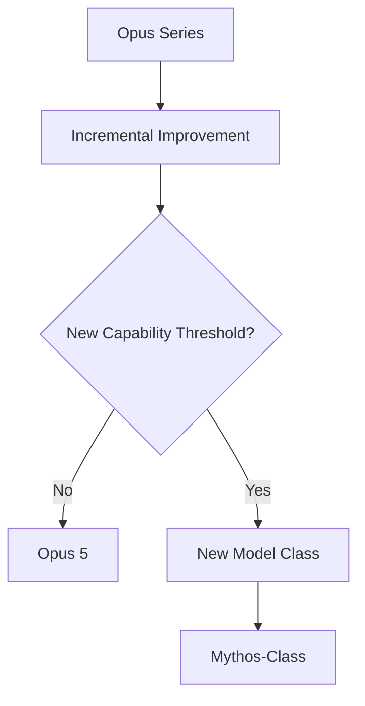

## Signaling a New Threshold

Version numbers imply continuity.

A new category implies transformation.

Anthropic appears to be signaling that Mythos-class systems crossed a boundary where deployment decisions can no longer be based solely on performance and product utility.

Instead, safety, governance, and misuse potential become central considerations.

For non-technical audiences, consider the difference between improving a car engine and inventing a commercial airplane. Both are transportation technologies, but the latter requires entirely different regulations, pilot training, and safety procedures.

Anthropic appears to view Mythos-class systems through a similar lens.

---

# The Fable and Mythos Naming Logic

Anthropic introduced two related names simultaneously:

- Claude Fable 5
- Claude Mythos 5

The naming choice was intentional and rooted in linguistic history.

## Origins of the Names

The word "Fable" derives from the Latin term *fabula*, while "Mythos" originates from the Greek term *mythos*.

Both concepts relate to narrative traditions and storytelling structures.

Rather than choosing unrelated names, Anthropic selected two terms from closely connected linguistic families.

## What the Names Reveal

The names suggest that Fable 5 and Mythos 5 are not independent systems.

Instead, they represent different expressions of the same foundational technology.

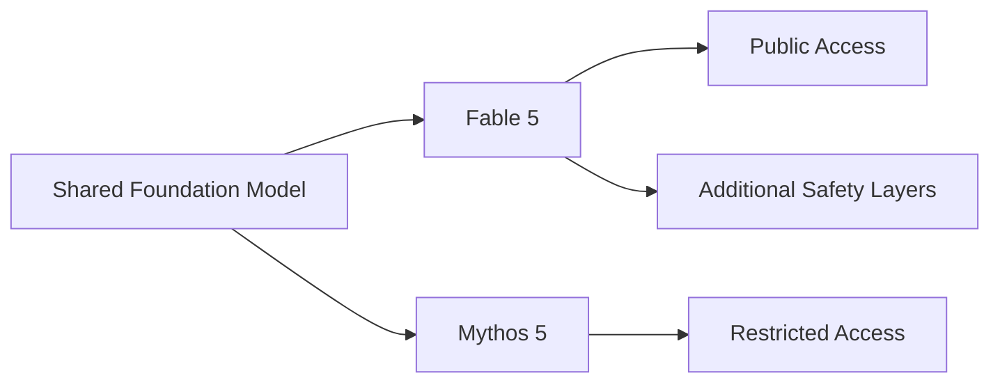

Anthropic's public explanations indicate that both models share the same underlying architecture.

The primary distinction lies in access policies and safety controls.

Fable 5 functions as the public-facing version, while Mythos 5 remains restricted to approved organizations participating in controlled programs.

The naming convention reinforces this relationship. Rather than presenting two separate model families, Anthropic presents two closely related manifestations of the same frontier system.

---

# Project Glasswing

Project Glasswing is one of the most important concepts associated with Mythos-class development.

## What Is Project Glasswing?

Project Glasswing is Anthropic's cybersecurity defense initiative focused on securing critical software in the AI era.

Anthropic describes it as an urgent effort to put advanced model capabilities to work for defensive cyber purposes, especially vulnerability discovery and remediation in high-impact software systems.

The initiative was created to address a difficult problem.

Anthropic believed frontier cyber capability was advancing quickly enough that defenders needed coordinated access, safeguards, and collaboration.

As publicly described, Glasswing is primarily a defender-focused cybersecurity program, not a generic all-purpose deployment framework for all frontier workloads.

## Why the Name Matters

Glasswing butterflies are known for their transparent wings.

The name reflects Anthropic's stated emphasis on transparency, observation, and careful monitoring during advanced AI deployment.

## Who Has Access?

Access was initially restricted to organizations capable of contributing to defensive and beneficial outcomes.

Examples included:

- Cybersecurity firms
- Research institutions
- Critical infrastructure organizations
- Government partners
- Large technology companies

These organizations could evaluate Mythos-class capabilities while helping Anthropic understand real-world risks.

## Objectives of Project Glasswing

Project Glasswing pursued several goals simultaneously.

First, it allowed trusted partners to benefit from advanced capabilities.

Second, it enabled Anthropic to study how organizations actually used frontier models.

Third, it generated evidence regarding misuse potential and operational risks.

Fourth, it informed future deployment decisions.

This evidence-driven approach distinguishes Project Glasswing from traditional product beta testing programs.

---

# Mythos Preview and the Road to Mythos 5

Before Mythos 5 existed, Anthropic introduced a system known as Mythos Preview.

## What Was Mythos Preview?

Mythos Preview functioned as the first controlled deployment of Mythos-class capabilities.

The model was not intended as a mainstream product.

Instead, it served as an experimental platform through which Anthropic could evaluate the behavior, usefulness, and risks of advanced systems.

## Why a Preview Stage Was Necessary

Anthropic believed Mythos-class capabilities required observation before broad deployment.

Questions included:

- How would organizations use these capabilities?
- What safeguards would prove effective?
- What risks might emerge?
- Which applications would provide the greatest societal benefit?

Mythos Preview provided a mechanism for answering these questions.

## Relationship to Mythos 5

Mythos 5 can be understood as the production successor to Mythos Preview.

The earlier program generated operational knowledge, safety insights, and deployment experience that informed the design of Mythos 5.

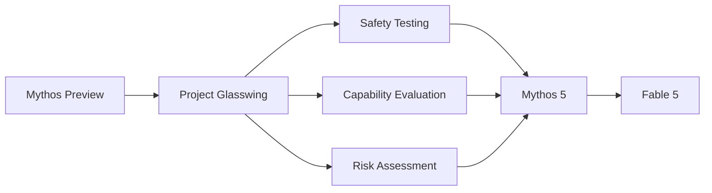

This progression reflects Anthropic's preference for gradual deployment rather than immediate mass release.

---

# The Capability Threshold Problem

One of Anthropic's most discussed statements regarding Mythos-class models is that they crossed a capability threshold associated with significant risks.

Understanding this threshold is critical.

## What Is a Capability Threshold?

A capability threshold occurs when a system becomes sufficiently effective that its societal impact changes qualitatively rather than incrementally.

For example, a tool that assists with software debugging creates different risks from a tool capable of autonomously identifying novel vulnerabilities across complex systems.

The latter may be dramatically more useful, but it may also be dramatically more dangerous if misused.

## Why Mythos-Class Crossed the Threshold

Anthropic identified advanced cybersecurity performance as a key factor.

The company suggested that Mythos-class systems possess abilities that could meaningfully accelerate vulnerability discovery and security research.

These capabilities create dual-use concerns.

A defensive security team might use the model to strengthen systems.

An attacker might attempt to use similar capabilities offensively.

The same feature therefore generates both benefits and risks.

## Why the Threshold Matters

Crossing a capability threshold changes deployment requirements.

Traditional product concerns focus on:

- Accuracy
- Reliability
- Cost
- User experience

Threshold-level systems introduce additional concerns:

- Misuse prevention
- Monitoring
- Governance
- Controlled access
- Regulatory compliance

Anthropic's decision to create the Mythos class reflects this shift in priorities.

---

# Responsible Scaling Policy (RSP)

Anthropic's Responsible Scaling Policy provides the framework for managing increasingly capable AI systems.

## Core Principle

The central idea is simple:

As AI capabilities increase, safety requirements must increase as well.

Rather than treating safety as a separate activity, the policy integrates safety directly into development and deployment decisions.

## Why RSP Matters for Mythos-Class Models

Anthropic's public communications indicate that Mythos-class systems triggered more stringent safety requirements than previous Claude models.

The company concluded that traditional deployment approaches were insufficient.

Instead, deployment required:

- Additional evaluations
- Stronger safeguards
- Structured monitoring
- Controlled access pathways

Project Glasswing emerged as one practical implementation of these principles.

## Relationship Between Capability and Safety

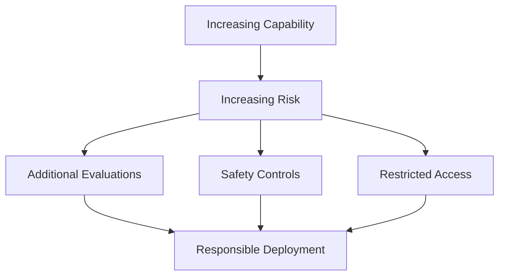

The Responsible Scaling Policy effectively formalizes this relationship.

---

# Timeline of Mythos-Class Development

The development of Mythos-class systems occurred through a carefully staged process rather than a single launch event.

## Visual Timeline

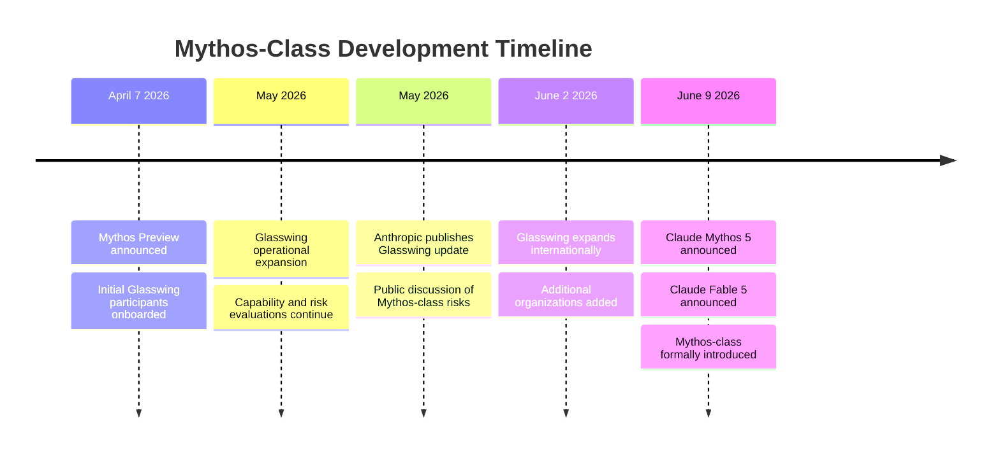

## April 7, 2026: Mythos Preview

The first visible stage of Mythos-class deployment involved Mythos Preview.

Selected organizations received access through Project Glasswing.

The focus was learning rather than large-scale commercialization.

## May 2026: Evaluation and Refinement

During May, Anthropic continued evaluating model behavior, gathering partner feedback, and refining deployment procedures.

The company publicly discussed the challenges associated with deploying systems possessing increasingly advanced cybersecurity capabilities.

## June 2, 2026: Glasswing Expansion

Anthropic expanded Project Glasswing to include a larger and more diverse group of organizations.

This move suggested growing confidence in both the program and its associated safeguards.

## June 9, 2026: Formal Launch

Anthropic announced Claude Mythos 5 and Claude Fable 5.

This event formally established Mythos-class models as a distinct category within the Claude ecosystem.

The launch also clarified Anthropic's strategy of providing different access levels to related systems sharing the same underlying foundation.

---

# Key Findings

> [!IMPORTANT]
> Anthropic did not present Mythos-class models as a routine successor to Opus. The company explicitly created a new category because it believes these systems crossed a capability threshold associated with meaningful cybersecurity and societal risks.

The most important conclusions from this research are:

1. Mythos-class represents a new tier above Opus rather than an incremental version update.

2. Anthropic deliberately avoided the name "Opus 5" because the company wanted to signal a qualitative shift in capability.

3. Fable 5 and Mythos 5 share a common foundation but differ in access controls and safety restrictions.

4. Project Glasswing served as the controlled deployment environment through which Anthropic evaluated advanced capabilities before broader release.

5. Mythos Preview functioned as the experimental predecessor to Mythos 5.

6. The concept of capability thresholds sits at the center of Anthropic's strategy. The company believes sufficiently advanced models require different deployment frameworks.

7. Anthropic's Responsible Scaling Policy provides the governance structure that connects increasing capability with increasing safety requirements.

8. The emergence of Mythos-class models may represent the beginning of a broader industry trend in which frontier AI systems are categorized not only by performance but also by risk profile and governance requirements.

---


# Fable 5 vs Mythos 5: Same Weights, Different Rules

> A technical and strategic analysis of Claude Fable 5 and Claude Mythos 5, Anthropic's first Mythos-class models.

 

---

# Table of Contents

1. Introduction
2. One Model, Two Products
3. Complete Fable 5 vs Mythos 5 Specification Table
4. Understanding the Safety Classifier Architecture
5. What Happens During a Refusal?
6. Why Refusals Return HTTP 200 Instead of 4xx
7. Fallback Mechanics Explained
8. Understanding the 5% Classifier Trigger Rate
9. Adaptive Thinking: Always On
10. Why Raw Chain of Thought Is Never Returned
11. Data Retention and Covered Model Requirements
12. Enterprise Deployment Considerations
13. Key Findings
 

---

# Introduction

One of the most misunderstood aspects of Anthropic's Mythos-class release is the relationship between Claude Fable 5 and Claude Mythos 5.

Many observers assume they are different models. Others assume Mythos 5 is merely a larger version of Fable 5.

Neither interpretation is correct.

According to Anthropic's official documentation and launch materials, Claude Fable 5 and Claude Mythos 5 are the same underlying model. The neural network weights, architecture, reasoning capabilities, context handling mechanisms, and adaptive thinking systems are fundamentally identical. The distinction is not model capability. The distinction is governance. Anthropic intentionally separated one model into two deployment configurations with different safety policies, access controls, and operational restrictions. citeturn0search0turn0news16

This means the central question is no longer "Which model is smarter?"

Instead, the important question becomes:

**What rules determine how the model can be used?**

The answer involves safety classifiers, fallback routing, Project Glasswing access controls, data retention requirements, and a new deployment philosophy that Anthropic believes is necessary for frontier AI systems.

---

# One Model, Two Products

## Understanding the Core Relationship

Anthropic repeatedly describes Fable 5 and Mythos 5 as two configurations of the same Mythos-class foundation model. At launch, Fable 5 was described as the publicly accessible configuration, while Mythos 5 was the restricted configuration available only to approved organizations through Project Glasswing. As of June 13, 2026, reported U.S. export-control actions introduced additional foreign-national access restrictions that materially changed availability status. citeturn0search0turn0news16

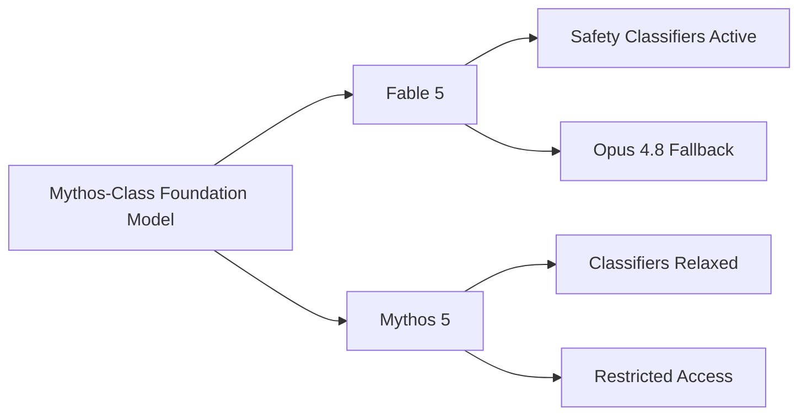

For most ordinary workloads, users receive the same level of capability from Fable 5 as they would from Mythos 5. The difference only becomes visible when requests enter domains that Anthropic considers high-risk.

These domains include:

- Cybersecurity
- Biology
- Chemistry
- Model distillation and replication

When conversations enter these areas, Fable 5 may defer to Claude Opus 4.8 instead of responding directly. Mythos 5 does not apply the same restrictions. citeturn0search6turn0search7

---

# Complete Fable 5 vs Mythos 5 Specification Table

## Side-by-Side Comparison

| Dimension | Claude Fable 5 | Claude Mythos 5 |
|------------|----------------|-----------------|
| Model Class | Mythos-Class | Mythos-Class |
| Underlying Weights | Same | Same |
| Architecture | Same | Same |
| Public Availability | June 9 launch: Yes; June 13, 2026: Restricted by export-control directive | No (restricted program) |
| Access Method | Claude API / Bedrock / Vertex AI / Foundry (subject to June 13, 2026 export restrictions) | Project Glasswing |
| API Model ID | claude-fable-5 | Restricted |
| Context Window | Same | Same |
| Max Output Tokens | Same | Same |
| Adaptive Thinking | Always On | Always On |
| Thinking Disabled | Not Supported | Not Supported |
| Raw Chain of Thought | Never Returned | Never Returned |
| Thinking Summary Mode | Supported | Supported |
| Thinking Omitted Mode | Supported | Supported |
| Safety Classifiers | Active | Relaxed in selected domains |
| Cybersecurity Restrictions | Yes | Reduced |
| Biology Restrictions | Yes | Reduced |
| Chemistry Restrictions | Yes | Reduced |
| Distillation Restrictions | Yes | Reduced |
| Fallback Model | Claude Opus 4.8 | Not Applicable |
| Data Retention | Mandatory 30 Days | Mandatory 30 Days |
| Zero Retention Available | No | No |
| Covered Model Classification | Yes | Yes |
| Pricing | As of June 9, 2026: $10/$50 per million tokens; subject to availability restrictions | Glasswing participant pricing (as of April 7, 2026): $25/$125 after credits expire |
| Deployment Audience | General Customers | Approved Organizations |

Source: Anthropic documentation and launch materials. citeturn0search0turn0news16

---

# Understanding the Safety Classifier Architecture

## What Are Safety Classifiers?

A common misconception is that safety mechanisms are hard-coded into Fable 5 itself.

Anthropic instead uses external classifier systems that monitor conversations and evaluate requests before responses are delivered. These classifiers operate as specialized detection models that identify potentially risky requests. citeturn0search6turn0search7

Conceptually, the architecture looks like this:

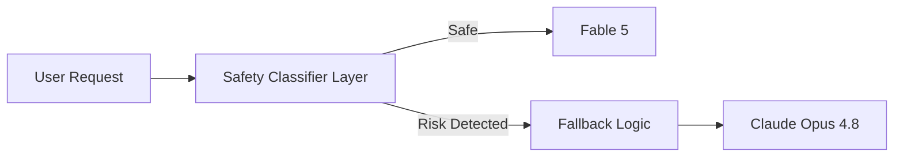

## The Three Primary Classifier Domains

As of June 13, 2026, Anthropic describes three major safeguard areas in deployment:

### Cybersecurity

The cybersecurity classifier looks for:

- Offensive security operations
- Exploit development
- Agentic hacking workflows
- Vulnerability exploitation

### Biology and Chemistry

These classifiers focus on:

- Biological misuse risks
- Dangerous synthesis information
- Sensitive life sciences content

### Model Distillation

This classifier targets attempts to:

- Replicate advanced model capabilities
- Extract proprietary reasoning systems
- Circumvent model protections

Anthropic reports that these safeguards trigger in fewer than 5% of sessions on average. citeturn0search6turn0search8

---

# What Happens During a Refusal?

## Understanding the API Response

Based on Anthropic documentation (as of June 13, 2026), refusal behavior is described as distinct from a transport/API failure.

Illustrative example (schema may change across API versions):

```json
{
  "id": "msg_01abc...",
  "type": "message",
  "model": "claude-fable-5",
  "stop_reason": "refusal",
  "refusal": {
    "classifier": "cybersecurity",
    "fallback_model": "claude-opus-4-8"
  },
  "content": []
}
```

## Field-by-Field Annotation

### id

Unique message identifier.

Used for logging, tracing, observability, and debugging.

### type

Indicates the API object type.

In this case it is a standard message object.

### model

Shows that the request was initially routed to Claude Fable 5.

### stop_reason

The critical field.

```json
"stop_reason": "refusal"
```

This indicates that generation was intentionally halted by Anthropic's safeguard systems.

The model did not fail.

The model did not crash.

The model successfully completed its policy evaluation and determined that a response should not be produced.

### refusal

Provides structured metadata explaining why the refusal occurred.

### classifier

Indicates which classifier triggered.

Example:

```json
"classifier": "cybersecurity"
```

### fallback_model

Identifies the recommended fallback destination.

Example:

```json
"fallback_model": "claude-opus-4-8"
```

### content

Empty because Fable 5 intentionally produced no output.

```json
"content": []
```

---

# Why Refusals May Return HTTP 200 Instead of 4xx

This design choice often surprises developers.

## The Key Principle

As documented by Anthropic (as of June 13, 2026), refusal is generally treated as an application-level model outcome rather than a transport-level API error.

A 4xx status means:

- Invalid request
- Authentication issue
- Permission issue
- Malformed input

None of these conditions occurred.

Instead:

1. The request was valid.
2. The request reached the model.
3. The classifier evaluated the request.
4. The system intentionally declined generation.

From Anthropic's perspective, the API completed successfully.

Therefore (illustrative pattern):

```text
HTTP 200 = Request Processed Successfully
stop_reason = refusal
```

The refusal itself becomes application-level information rather than transport-level failure.

This makes automated fallback handling significantly easier.

---

# Fallback Mechanics Explained

## Why Fallback Exists

Anthropic did not want Fable 5 to simply reject every sensitive request.

Instead, the company routes many requests to Claude Opus 4.8.

This allows users to continue receiving assistance while preserving Mythos-class safeguards. citeturn0news17turn0search6

---

## Server-Side Fallback

The simplest approach.

The API automatically redirects requests.

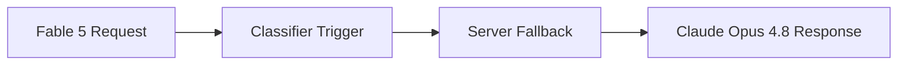

Example result:

```json
{
  "model": "claude-opus-4-8",
  "stop_reason": "end_turn",
  "fallback_from": "claude-fable-5"
}
```

The client receives a completed answer without implementing custom routing.

---

## Client-Side Fallback

The SDK detects:

```json
"stop_reason": "refusal"
```

and automatically retries against Opus 4.8.

Advantages:

- More visibility
- Better logging
- Detailed analytics

---

## Manual Retry

The application handles routing explicitly.

Pseudo-code:

```python
if response.stop_reason == "refusal":
    retry_with_opus()
```

This approach provides maximum control.

---

## What Is Fallback Credit?

Anthropic introduced fallback credit to prevent customers from paying twice for repeated prompt processing during fallback workflows. Documentation describes fallback credit as a mechanism that reduces duplicated prompt-cache costs when requests must be rerun on Opus 4.8. citeturn0search0

Without fallback credit:

1. Fable processes prompt.
2. Opus processes prompt again.
3. Customer pays twice.

With fallback credit:

Prompt processing costs are partially offset to avoid excessive billing penalties.

---

# Understanding the 5% Classifier Trigger Rate

Anthropic reports that safeguard classifiers trigger in fewer than 5% of sessions on average. citeturn0search6turn0search8

## What Does This Mean?

Suppose a company processes:

```text
10,000 requests/day
```

Worst-case planning estimate:

```text
10,000 × 5%
= 500 fallback events/day
```

Expected range:

```text
200–500 fallbacks/day
```

depending on workload composition.

## Architecture Recommendation

Enterprise applications should assume fallback can occur at any time.

Recommended architecture:

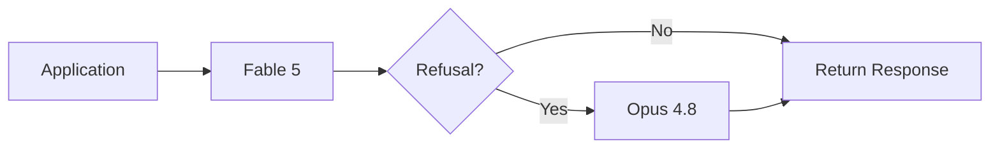

The user experience should remain seamless.

Fallback should be observable but not disruptive.

---

# Adaptive Thinking: Always On

## What Is Adaptive Thinking?

Anthropic introduced Adaptive Thinking as the only reasoning mode available on Mythos-class systems. citeturn0search0

Unlike earlier models, thinking cannot be disabled.

```json
{
  "thinking": {
    "type": "disabled"
  }
}
```

is not supported.

Instead, the model dynamically determines how much reasoning effort to allocate.

## Difference From Earlier Thinking Modes

Earlier Claude models often exposed explicit reasoning controls.

Mythos-class models shift toward:

- Dynamic allocation
- Automatic reasoning depth
- Effort-based control

The user specifies effort.

The model decides execution strategy.

---

## Summarized vs Omitted

### Summarized

```json
"thinking.display": "summarized"
```

Returns a readable summary of reasoning.

Useful for:

- Audits
- Evaluations
- Human review

### Omitted

```json
"thinking.display": "omitted"
```

Returns empty thinking blocks.

Useful for:

- Production systems
- Cost-sensitive deployments
- Simpler user interfaces

Anthropic identifies omitted as the default mode. citeturn0search0

---

# Why Raw Chain of Thought Is Never Returned

## The Policy

Anthropic explicitly states:

> Raw chain of thought is never returned on Fable 5 or Mythos 5. citeturn0search0

## Why This Matters

Mythos-class models possess capabilities beyond previous public systems.

Returning complete internal reasoning traces could:

- Reveal safety mechanisms
- Enable jailbreak optimization
- Leak proprietary reasoning structures
- Increase attack surface

Anthropic therefore provides either:

1. A summarized explanation.
2. No explanation.

But never the full internal reasoning trace.

## Implications for Debugging

Advantages:

- Stronger security
- Better protection against misuse
- Reduced prompt extraction risk

Disadvantages:

- Harder model debugging
- Reduced transparency
- More difficult failure analysis

Organizations relying on chain-of-thought auditing must adapt their evaluation strategies accordingly.

---

# Data Retention and Covered Model Requirements

## The 30-Day Rule

Perhaps the most operationally significant Mythos-class policy is mandatory retention.

Both Fable 5 and Mythos 5 require:

```text
30-Day Data Retention
```

and are designated Covered Models. citeturn0search0turn0news15

## What Does Covered Model Mean?

Covered Models are subject to additional monitoring and safety requirements.

As a result:

- Zero-retention agreements do not apply.
- Traffic is retained for safety analysis.
- Monitoring systems remain active.

Anthropic states that retained traffic is used to detect novel attacks, jailbreaks, and false positives rather than model training. citeturn0search7turn0search2

## Why Anthropic Requires Retention

Anthropic argues that defending against frontier-model attacks requires visibility into real-world usage patterns.

Without retention:

- New jailbreak techniques may go undetected.
- Abuse detection becomes weaker.
- Classifier improvement becomes harder.

---

## Which Customers May Face Problems?

The 30-day requirement may be a blocking issue for:

### Healthcare Organizations

Protected medical information may create compliance concerns.

### Defense Contractors

Sensitive operational data may prohibit retention.

### Financial Institutions

Regulatory constraints may restrict third-party storage.

### Legal Firms

Attorney-client privilege concerns may arise.

### Government Agencies

Data sovereignty requirements may prevent deployment.

For these organizations, Opus, Sonnet, or alternative deployment architectures may remain preferable until retention policies evolve. citeturn0news15turn0search2

---

# Enterprise Deployment Considerations

Organizations evaluating Mythos-class systems should treat deployment as both a technical and governance decision.

Checklist:

- Measure fallback rates.
- Log refusal events.
- Monitor classifier domains.
- Document retention impacts.
- Evaluate compliance requirements.
- Implement fallback routing.
- Train support teams.

The strongest deployment strategy is not simply connecting to Fable 5. It is building an architecture that assumes refusals, fallbacks, retention requirements, and adaptive reasoning are normal operating conditions.

---

# Key Findings

> [!IMPORTANT]
> Fable 5 and Mythos 5 are the same model. The distinction is not intelligence but governance.

Key conclusions:

1. Same weights, same architecture, different deployment rules.
2. Fable 5 uses active safety classifiers.
3. Mythos 5 is available only through Project Glasswing.
4. Refusals return HTTP 200 because the API completed successfully.
5. Fallback to Opus 4.8 is a core design feature.
6. Fewer than 5% of sessions trigger safeguards on average.
7. Adaptive Thinking is always enabled.
8. Raw chain of thought is never exposed.
9. Both models require 30-day retention.
10. Regulated industries must evaluate retention requirements carefully.

---
#
# What Fable 5 and Mythos 5 Can Actually Do


> A technical analysis of Anthropic's Mythos-class capabilities, safety classifier architecture, jailbreak resistance, constitutional AI lineage, alignment evaluations, and the dual-use challenge.


---

# Table of Contents

1. Introduction
2. What Are Safety Classifiers?
3. Why Classifiers Matter for Mythos-Class Models
4. The Three Protected Domains
5. Cybersecurity Classifiers
6. Biology & Chemistry Classifiers
7. Distillation Classifiers
8. Jailbreak Resistance and Red Teaming
9. False Positives and Trade-Offs
10. Constitutional AI and Classifier Evolution
11. Alignment Assessment Findings
12. The Dual-Use Problem
13. Key Takeaways
 

---

# Introduction

The release of Claude Fable 5 and Claude Mythos 5 introduced a new idea into frontier AI deployment. Earlier generations of large language models primarily relied on training-time alignment and refusal behavior. If a user requested something dangerous, the model itself was expected to recognize the request and refuse.

Anthropic's Mythos-class deployment represents a different philosophy.

Instead of relying exclusively on the model, Anthropic introduced dedicated safety classifiers that operate alongside the model. These classifiers act as an independent security layer capable of detecting potentially dangerous requests before the model generates a response.

This distinction is important because Mythos-class systems possess significantly stronger capabilities than previous Claude generations, particularly in cybersecurity, software engineering, scientific reasoning, and long-horizon task execution. The stronger the model becomes, the greater the incentive for adversarial actors to bypass safeguards.

Anthropic's answer is not simply stronger refusal training. It is a multi-layered architecture in which specialized classifier systems evaluate requests before generation occurs.

---

# What Are Safety Classifiers?

## The Basic Concept

A safety classifier is a separate AI system whose job is not to answer questions but to classify them.

Instead of generating content, the classifier evaluates whether a request falls into a category that requires intervention.

Conceptually:

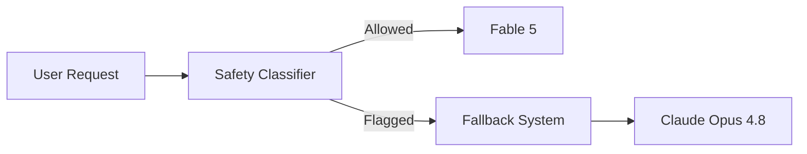

The classifier acts as a gatekeeper.

Its purpose is to determine whether the request should proceed normally, be redirected, or be blocked entirely.

## How Classifiers Differ from Refusal Training

Earlier generations of AI systems relied primarily on in-model refusal training.

In that approach:

1. The model receives a dangerous request.
2. The model recognizes the request.
3. The model generates a refusal.

The challenge is that the same model responsible for answering questions is also responsible for enforcing policy.

This creates several weaknesses:

- Jailbreaks target the same model.
- Policy enforcement competes with task completion.
- Attackers can sometimes manipulate the model into bypassing safeguards.

Classifier-based architectures separate these responsibilities.

The classifier focuses on detection.

The model focuses on generation.

This separation creates stronger security boundaries.

## Architectural Advantages

The architecture provides several benefits.

### Independent Evaluation

A separate system evaluates risk before generation occurs.

### Faster Safety Updates

Anthropic can update classifiers without retraining the entire foundation model.

### Better Monitoring

Classifiers provide structured information about why requests were intercepted.

### Defense in Depth

Even if users discover new prompting techniques, they must bypass multiple systems rather than one.

---

# Why Classifiers Matter for Mythos-Class Models

Mythos-class systems occupy a different risk category from previous models.

Anthropic argues that these systems possess capabilities that create meaningful dual-use concerns.

The same capability that helps a security researcher identify a vulnerability could potentially help an attacker exploit it.

The same scientific reasoning capability that accelerates beneficial research could potentially assist harmful activities.

The classifier architecture exists because Anthropic believes Mythos-class capabilities are powerful enough to justify additional safeguards beyond traditional alignment methods.

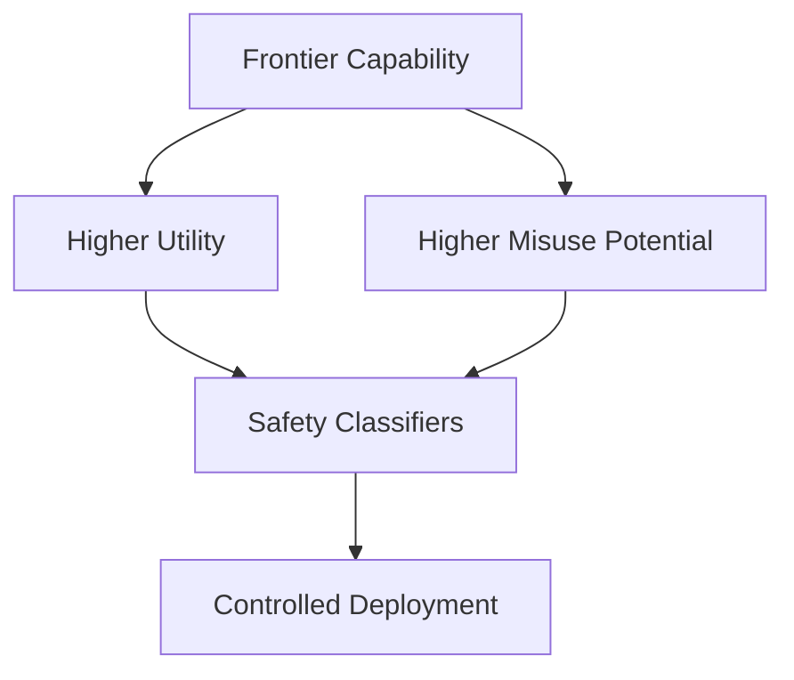

---

# The Three Protected Domains

Anthropic's Mythos-class classifier system focuses on three major domains.

| Domain | Why Protected |
|----------|--------------|
| Cybersecurity | Advanced vulnerability discovery and attack-chain assistance |
| Biology & Chemistry | Sensitive scientific capabilities with potential misuse implications |
| Distillation | Protection against replication and extraction of frontier model capabilities |

Each domain addresses a different category of risk.

---

# Cybersecurity Classifiers

## Why Cybersecurity Is Special

Anthropic repeatedly highlights cybersecurity as one of the strongest capability areas for Mythos-class systems.

The company states that these models can assist with:

- Vulnerability identification
- Security auditing
- Attack-chain analysis
- Exploit reasoning
- Software review
- Security research

These capabilities are valuable because organizations constantly struggle to identify weaknesses before attackers discover them.

However, the same capabilities create obvious risks.

## The Agentic Hacking Concern

Anthropic specifically references agentic hacking workflows.

These involve multi-stage attack chains such as:

1. Reconnaissance
2. Target mapping
3. Vulnerability discovery
4. Exploitation
5. Privilege escalation
6. Lateral movement

Traditional models may assist with isolated tasks.

Mythos-class systems appear capable of supporting larger workflows that span multiple stages.

This is one reason Anthropic created cybersecurity classifiers.

## How the Cybersecurity Classifier Works

The classifier attempts to identify requests associated with offensive security operations.

Examples may include:

- Exploit development
- Attack planning
- Privilege escalation guidance
- Offensive automation

When the classifier triggers, Fable 5 does not respond directly.

Instead, the system may fall back to Claude Opus 4.8 or refuse generation.

## The Firefox Metric

Anthropic referenced Firefox-related vulnerability evaluation as part of its safety validation process.

The company used realistic software security tasks to evaluate capability and classifier effectiveness. The broader objective was measuring whether the classifier system could successfully identify and intervene when high-risk cybersecurity capabilities were being requested while preserving legitimate functionality.

The significance of this metric is not merely performance. It demonstrates whether safeguards remain effective as model capability increases.

---

# Biology & Chemistry Classifiers

## Why Biology and Chemistry Matter

Biology and chemistry are dual-use fields.

The overwhelming majority of scientific research in these domains is beneficial.

However, certain forms of knowledge may have safety implications.

Anthropic concluded that Mythos-class systems possess scientific reasoning capabilities strong enough to justify additional monitoring.

## What Triggered Concern?

The concern is not basic educational content.

The concern involves advanced scientific workflows that could potentially:

- Enable dangerous experimentation
- Accelerate harmful research
- Circumvent existing safeguards

The classifier therefore focuses on requests that move beyond ordinary educational discussion.

## What Happens When Triggered?

When the classifier identifies a request within the protected domain:

1. The request is evaluated.
2. Risk classification occurs.
3. Fable 5 may refuse.
4. Fallback logic may activate.

The goal is not to prevent legitimate science.

The goal is to prevent misuse of advanced capabilities.

## Impact on Researchers

Biology researchers and chemistry researchers may experience the highest rate of false positives because their legitimate work sometimes resembles patterns associated with sensitive activities.

This represents one of the central trade-offs in the system.

---

# Distillation Classifiers

## What Is Distillation?

In machine learning, distillation generally refers to transferring capabilities from a larger model into a smaller model.

In the Mythos-class context, the concern is broader.

Anthropic is concerned about attempts to:

- Replicate Mythos-class capabilities
- Extract proprietary reasoning behavior
- Reconstruct model functionality
- Create competing systems using generated outputs

## Why Distillation Matters

Mythos-class systems represent a substantial investment in training, alignment, and safety engineering.

Anthropic views unauthorized replication as both a business concern and a safety concern.

If advanced capabilities can be copied without safeguards, the deployment controls surrounding Mythos-class systems become less effective.

## Role of the Distillation Classifier

The classifier attempts to identify requests whose primary objective appears to be capability extraction rather than ordinary usage.

This includes patterns that may indicate large-scale model replication efforts.

---

# Jailbreak Resistance and Red Teaming

## What Is a Jailbreak?

A jailbreak is an attempt to bypass model safeguards.

Examples include:

- Prompt injection
- Instruction manipulation
- Role-playing attacks
- Policy evasion techniques

The stronger a model becomes, the stronger the incentive to jailbreak it.

## Why Mythos-Class Attracts Attackers

A highly capable frontier model offers enormous value.

Potential adversaries may seek:

- Offensive security assistance
- Scientific guidance
- Proprietary capability extraction
- Safety bypass methods

Because the rewards are greater, the attack pressure is also greater.

## The Significance of 1,000+ Hours of Testing

Anthropic reported extensive internal and external red-team testing exceeding one thousand hours.

This testing involved attempts to:

- Circumvent classifiers
- Bypass safeguards
- Discover universal jailbreak strategies

The company reported that no universal jailbreaks were discovered during testing.

This does not mean the system is impossible to bypass.

It means researchers did not find a single technique that consistently defeated protections across contexts.

## The Meaning of the 95% Figure

Anthropic also stated that more than 95% of sessions remain on Fable 5 without fallback.

This statistic is important.

It indicates that the classifier system is not constantly interfering with ordinary usage.

Instead:

- Most users experience normal operation.
- Only a small fraction trigger intervention.

This suggests that the system attempts to balance utility and safety rather than aggressively blocking broad categories of content.

---

# False Positives and Trade-Offs

## What Is a False Positive?

A false positive occurs when a legitimate request is incorrectly identified as risky.

For example:

A cybersecurity researcher performing defensive analysis may be mistaken for an attacker.

A biology researcher conducting legitimate work may trigger safety mechanisms.

The request is harmless, but the classifier errs on the side of caution.

## Why False Positives Occur

Anthropic explicitly acknowledges that launch-stage classifiers are deliberately conservative.

The company prefers occasional over-blocking rather than under-blocking.

This is a common strategy in security systems.

Examples include:

- Spam filters
- Fraud detection systems
- Intrusion detection systems

All produce false positives.

## Impact on Professional Users

The groups most affected are likely:

### Cybersecurity Professionals

Security research often resembles attack behavior.

### Biology Researchers

Advanced scientific questions may resemble sensitive requests.

### Chemistry Researchers

Legitimate technical work can occasionally overlap with protected categories.

## Reducing False Positives

Anthropic has indicated that classifier refinement remains an ongoing process.

Over time the company expects:

- Better classification accuracy
- Improved context understanding
- Fewer unnecessary interventions

This mirrors the evolution of spam detection and content moderation systems, which typically become more precise through real-world feedback.

---

# Constitutional AI and Classifier Evolution

## The Foundation: Constitutional AI

Anthropic is widely known for its Constitutional AI approach.

Instead of relying solely on human demonstrations, models are guided by principles that help shape behavior.

These principles act as a constitution governing responses.

The objective is creating systems that are:

- Helpful
- Honest
- Harmless

## Next-Generation Constitutional Classifiers

Anthropic previously conducted research into constitutional classifiers.

These systems extended the Constitutional AI concept beyond the model itself.

Instead of embedding all safety mechanisms directly into the model, separate classifiers could enforce constitutional principles.

## What Fable 5 Adds

Fable 5 builds on this lineage.

The innovation is not merely classification.

The innovation is combining:

1. Constitutional principles
2. Frontier capability evaluation
3. Real-time intervention
4. Fallback routing

This creates a deployment architecture rather than a simple moderation layer.

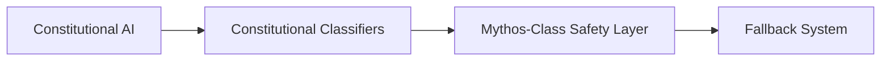

The result is a more flexible and maintainable safety framework.

---

# Alignment Assessment Findings

## What Is Alignment?

Alignment refers to the degree to which model behavior remains consistent with intended goals and values.

Researchers often evaluate:

- Deception
- Manipulation
- Misuse cooperation
- Goal preservation
- Policy compliance

## Mythos 5 Assessment Results

Anthropic reported that automated alignment assessments found Mythos 5's level of problematic behavior to be broadly similar to Opus 4.8 despite significantly stronger capabilities.

This finding is important.

Historically, increasing capability sometimes raises concerns that models may become harder to control.

Anthropic's results suggest that capability increased substantially while alignment characteristics remained relatively stable.

## Why This Matters

Imagine two pilots.

One flies a small aircraft.

The other flies a much more powerful aircraft.

If both exhibit the same safety discipline, the more capable aircraft becomes substantially more useful without necessarily becoming less controllable.

Anthropic's alignment findings suggest a similar pattern.

The model became more capable, but evidence did not indicate a proportional increase in deception or misuse-oriented behavior.

## Remaining Caveats

Alignment assessments are not guarantees.

They are measurements under specific testing conditions.

Continuous evaluation remains necessary because frontier systems continue evolving rapidly.

---

# The Dual-Use Problem

## Analysis

The dual-use problem sits at the center of the Mythos-class deployment strategy. A dual-use capability is one that can be used for both beneficial and harmful purposes. Cybersecurity provides the clearest example. A security professional may use a model to identify vulnerabilities before attackers discover them, strengthen infrastructure, and improve defenses. A malicious actor may attempt to use the same capability to locate weaknesses and exploit them. The underlying knowledge is identical; only the intent differs.

Anthropic's challenge is therefore not determining whether a capability is useful. The challenge is determining how that capability should be deployed. Fable 5 represents an attempt to balance these competing pressures. Most users receive access to Mythos-class intelligence, but sensitive domains are monitored by dedicated classifiers. When risk indicators appear, requests may be redirected away from the full Mythos-class capability profile.

The line between legitimate use and misuse is not always obvious. Security researchers, scientists, and engineers may occasionally experience friction because their work resembles patterns associated with risk. Anthropic has chosen to accept some false positives in exchange for stronger safeguards. Ultimately, the company, its safety teams, and its Responsible Scaling Policy determine where these boundaries are drawn, while ongoing evaluation and external feedback help refine those decisions over time.

---

# Key Takeaways

> [!IMPORTANT]
> The most significant innovation in Fable 5 is not merely model capability. It is the deployment architecture built around safety classifiers.

Key conclusions:

1. Safety classifiers are separate AI systems rather than part of the generation model.
2. Classifiers provide stronger security than traditional refusal-only approaches.
3. Cybersecurity, biology & chemistry, and distillation are the three protected domains.
4. Mythos-class capabilities created the need for additional safeguards.
5. More than 95% of sessions reportedly remain on Fable 5 without fallback.
6. Anthropic reports no universal jailbreak discovered during extensive red-team testing.
7. False positives are an acknowledged launch trade-off.
8. Fable 5 extends Anthropic's Constitutional AI research into deployment-time enforcement.
9. Alignment assessments suggest Mythos 5 remains broadly comparable to Opus 4.8 in measured alignment characteristics despite stronger capabilities.
10. The dual-use problem remains the central challenge in deploying frontier AI systems responsibly.

---

# References

#
# Access Tier, Pricing and Availability

> A deployment-focused guide to Claude Fable 5 and Claude Mythos 5 covering platform availability, pricing, subscription access, data retention requirements, and model-selection decisions.

---

# Table of Contents

1. Introduction
2. Platform Availability
3. Access Models Explained
4. Pricing and Cost Analysis
5. Subscription Access and the June 22 Transition
6. Data Retention and Compliance
7. Decision Framework
8. Key Takeaways

---

# Introduction

Claude Fable 5 and Claude Mythos 5 share the same underlying Mythos-class foundation model, but they are distributed through very different access channels. Understanding where each model is available, how organizations gain access, how billing works, and what compliance obligations apply is essential before deployment.

For most organizations, access is not primarily a technical question. It is a governance, compliance, and procurement question.

## June 2026: Access Restrictions Update

As of June 13, 2026, Reuters reported that a U.S. export-control directive required Anthropic to suspend Fable 5 and Mythos 5 access for foreign nationals pending resolution. That means launch-era availability statements should be read as historical, and current access must be treated as jurisdiction-dependent rather than universally available.

This update is important because it changes how the platform availability and access-model sections below should be interpreted.

---

# Platform Availability

## Where Fable 5 Is Available

Fable 5 launched June 9, 2026, through multiple commercial channels (Claude API, Bedrock, Vertex AI, Foundry). However, on June 13, 2026, Reuters reported a U.S. export-control directive requiring Anthropic to disable Fable 5 and Mythos 5 access for foreign nationals pending resolution.

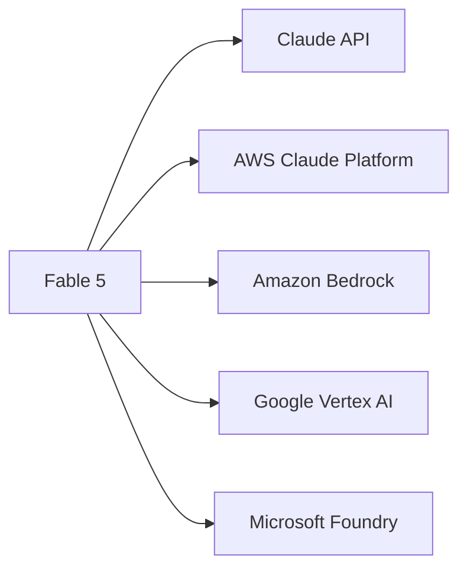

### Claude API

At launch (June 9, 2026), the Claude API was the most direct route. As of June 13, 2026, access is restricted and must be considered policy- and jurisdiction-dependent due to export-control directives.

### Amazon Bedrock

Amazon Bedrock previously provided managed access; as of June 13, 2026, availability is affected by export-control restrictions.

Advantages:

- IAM integration
- AWS governance controls
- Enterprise procurement alignment
- Existing cloud billing workflows

### Google Vertex AI

Organizations standardized on Google Cloud may deploy through Vertex AI, subject to applicable legal/policy controls and availability status as of June 13, 2026.

### Microsoft Foundry

Microsoft Foundry remains an enterprise deployment pathway in principle, subject to the same export-control and compliance constraints as of June 13, 2026.

---

## Where Mythos 5 Is Available

Unlike Fable 5, Mythos 5 is not generally available.

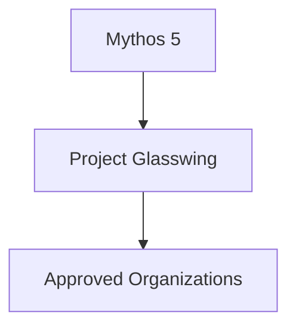

Mythos 5 is restricted to approved organizations participating in Project Glasswing.

Examples may include:

- Government organizations
- Critical infrastructure operators
- Security research institutions
- Advanced enterprise customers
- Selected technology companies

---

## What "Approved Customers" Means

Being an approved customer generally involves:

1. Organizational review.
2. Intended-use evaluation.
3. Risk assessment.
4. Compliance checks.
5. Contractual agreements.

Access is therefore governed rather than purchased directly.

---

# Access Models Explained

## Fable 5 Access Model

Fable 5 launched for broad deployment (June 9, 2026); as of June 13, 2026, access status is conditional and restricted.

| Feature | Availability |
|----------|-------------|
| Public API Access | June 9–13: Available; As of June 13, 2026: Conditional/restricted |
| Enterprise Contracts | Yes, subject to compliance review and June 13, 2026 export restrictions |
| Cloud Providers | Available at launch; as of June 13, 2026, subject to legal/export controls |
| Subscription Access | June 9–22: Included in plans; as of June 13, 2026: policy-dependent |
| Project Glasswing Required | No |

---

## Mythos 5 Access Model

Mythos 5 follows a restricted-access model.

| Feature | Availability |
|----------|-------------|
| Public API Access | No |
| General Availability | No |
| Glasswing Approval Required | Yes |
| Enterprise Review | Yes |
| Restricted Capability Access | Yes |

---

# Pricing and Cost Analysis

## Published Pricing

Publicly documented pricing should be separated by product and phase:

| Product/Phase | Input Price | Output Price |
|---------|------------|-------------|
| Fable 5 public API launch pricing | $10 / Million Tokens | $50 / Million Tokens |
| Mythos Preview participant pricing after usage credits | $25 / Million Tokens | $125 / Million Tokens |

Do not assume Mythos 5 generally available pricing is identical to Fable 5 unless Anthropic publishes explicit confirmation for that exact product/phase.

---

## Example Monthly Cost Calculation

Assumptions:

- 1,000,000 requests/month
- 1,000 input tokens/request
- 500 output tokens/request

### Input Cost

```text
1,000,000 × 1,000
= 1,000,000,000 input tokens
```

Cost:

```text
1,000 × $10
= $10,000
```

### Output Cost

```text
1,000,000 × 500
= 500,000,000 output tokens
```

Cost:

```text
500 × $50
= $25,000
```

### Total

```text
$10,000 + $25,000
= $35,000/month
```

---

## Comparative Cost Illustration

| Model | Approx Monthly Cost* |
|---------|--------------------|
| Sonnet 4.6 | Lowest |
| Opus 4.8 | Medium |
| Fable 5 | Higher |
| Mythos 5 | Similar Pricing Structure |

*Actual costs depend on final token usage and provider pricing.

---

# Subscription Access and the June 22 Transition

## What Happened?

Anthropic announced that Fable 5 would be available within qualifying subscription plans through June 22, 2026.

Eligible plans included:

- Pro
- Max
- Team
- Seat-based Enterprise

This allowed users to experiment with Mythos-class capabilities without immediate usage-credit charges.

---

## Why Anthropic Did This

The temporary inclusion served several goals.

### Encourage Evaluation

Organizations could test workloads before committing to large-scale deployment.

### Gather Feedback

Anthropic could observe real-world usage patterns.

### Reduce Adoption Friction

Users could experience the model without immediately adjusting budgets.

---

## What Changes After June 22?

After the introductory period, usage transitions toward credit-based consumption.

This means:

- Usage tracking becomes important.
- Budget planning becomes necessary.
- Heavy users should monitor costs.

---

## What Companies Should Do

Recommended preparation:

1. Measure current usage.
2. Estimate token consumption.
3. Build internal cost forecasts.
4. Establish monitoring dashboards.
5. Create usage alerts.

---

# Data Retention and Compliance

## The 30-Day Rule

Both Fable 5 and Mythos 5 are designated Covered Models.

Covered Models require:

```text
30-Day Data Retention
```

This means interactions may be retained for safety monitoring and abuse detection purposes.

---

## Why Retention Exists

Anthropic argues that frontier-model safety requires visibility into real-world usage patterns.

Benefits include:

- Detecting novel jailbreaks
- Improving classifiers
- Monitoring abuse attempts
- Investigating incidents

---

## Compliance Challenges

Certain industries may face regulatory friction.

### Healthcare

Potential concerns:

- Protected health information
- Privacy obligations

### Financial Services

Potential concerns:

- Sensitive customer records
- Regulatory audit requirements

### Legal Sector

Potential concerns:

- Attorney-client privilege
- Confidential case materials

### Government

Potential concerns:

- Data sovereignty
- National-security restrictions

---

## Enterprise Implications

Organizations should review:

- Retention policies
- Data-processing agreements
- Internal compliance requirements
- Regional regulations

---

## Alternatives

Organizations unable to accept retention requirements may consider:

- Alternative Claude models
- Segmented workflows
- Internal filtering systems
- Non-Mythos deployments

---

# Decision Framework

## Which Model Should You Choose?

| User Type | Recommended Model | Platform | Estimated Monthly Cost | Notes |
|------------|------------------|----------|-----------------------|-------|
| Individual Developer | Fable 5 | Claude API | Low to Moderate | Best balance of access and capability |
| 10-Person Startup | Fable 5 | Claude API / Bedrock | Moderate | Easy deployment |
| Enterprise Engineering Team | Fable 5 | Bedrock / Vertex AI / Foundry | High | Strong governance support |
| Security Research Organization | Mythos 5 (if approved) | Project Glasswing | Custom | Requires approval |
| Government Agency | Mythos 5 (if approved) | Project Glasswing | Custom | Additional review |
| Critical Infrastructure Operator | Mythos 5 (if approved) | Project Glasswing | Custom | Restricted access path |

---

## Visual Decision Tree

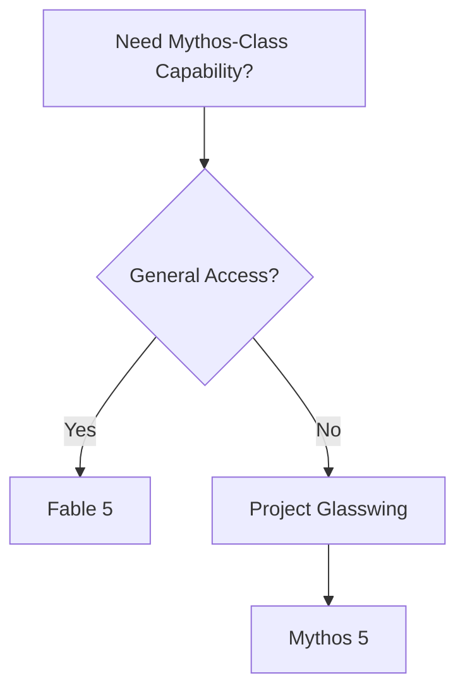

---

# Key Takeaways

> [!IMPORTANT]
> The largest difference between Fable 5 and Mythos 5 is not price. It is access governance.

Key conclusions:

1. Fable 5 launched June 9, 2026 across major AI platforms; as of June 13, 2026, availability is subject to export-control and policy restrictions.
2. Mythos 5 is restricted to approved organizations.
3. Both models share the same Mythos-class foundation.
4. Pricing is based on token consumption.
5. Subscription access changed after the introductory period.
6. Both models require 30-day retention.
7. Compliance review is essential before enterprise deployment.
8. Most organizations should begin with Fable 5.
9. Mythos 5 is intended for specialized high-trust environments.
10. Procurement, compliance, and governance are as important as technical integration.

---

#

# Competitive Landscape: Fable 5 vs The Field

> An evidence-based analysis of where Claude Fable 5 sits in the 2026 frontier AI landscape compared with GPT-5.5 and Gemini. This report focuses on software engineering, knowledge work, scientific reasoning, vision, enterprise deployment, and safety architecture.

---

# Table of Contents

1. Introduction
2. The Frontier AI Landscape in 2026
3. Fable 5 vs GPT-5.5
4. Fable 5 vs Gemini
5. Safeguards as a Competitive Differentiator
6. Model Selection Framework for Tekravio
7. Honest Verdict

---

# Introduction

The release of Claude Fable 5 changed the frontier-model conversation.

For most of 2025 and early 2026, the competitive landscape revolved around three major players:

- Anthropic
- OpenAI
- Google DeepMind

Each company pursued a different strategy.

OpenAI focused heavily on agentic workflows, multimodal reasoning, and productivity integration.

Google DeepMind emphasized multimodal intelligence, long-context reasoning, and ecosystem integration.

Anthropic focused on reliability, software engineering performance, knowledge work, and AI safety.

Fable 5 represents the culmination of that strategy.

Unlike earlier Claude models, Fable 5 is not simply a larger language model. It is a Mythos-class system that combines frontier-level performance with a classifier-based safeguard architecture that is unique among major AI providers.

The key question is therefore not whether Fable 5 is good.

The key question is:

**Where is it objectively better than GPT-5.5 and Gemini, and where is it not?**

---

# The Frontier AI Landscape in 2026

## Positioning of the Major Models

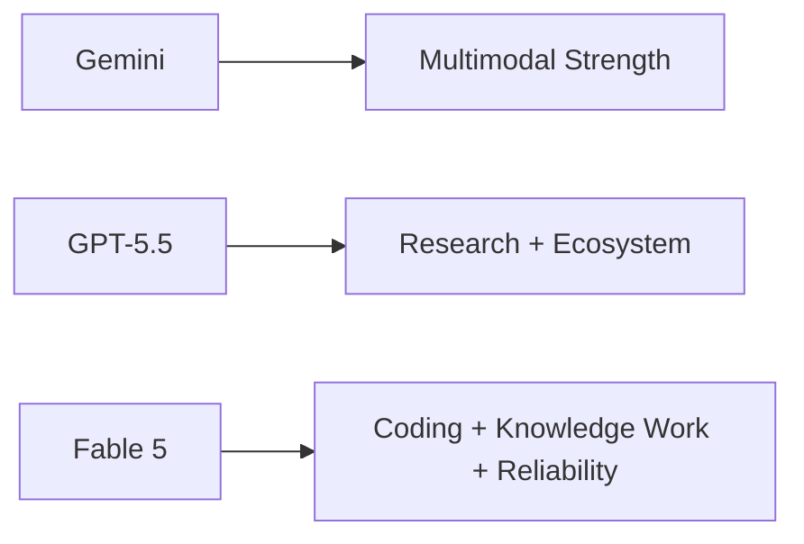

As of June 13, 2026, each model family dominates different categories based on published benchmarks.

| Area | Leader (as of June 13, 2026) |
|--------|--------------|
| Autonomous Software Engineering | Fable 5 |
| Enterprise Knowledge Work | Fable 5 |
| OpenAI Ecosystem Workflows | GPT-5.5 |
| Native Audio and Video | GPT-5.5 |
| Google Workspace Integration | Gemini |
| Vision and Multimodal Productivity | Gemini / Fable 5 |
| Safety Architecture | Fable 5 |
| Cost Efficiency | Gemini |
| Coding Agents | Fable 5 |

No model wins every category.

---

# Fable 5 vs GPT-5.5

## Overview

GPT-5.5 is OpenAI's flagship reasoning and productivity model released in April 2026. OpenAI positions it as a system optimized for coding, research, data analysis, and knowledge work. According to OpenAI, GPT-5.5 achieves state-of-the-art performance across several enterprise-focused benchmarks including GDPval, OSWorld-Verified, and Tau2-bench. citeturn0search0

Fable 5, however, targets a somewhat different objective.

Anthropic positions Fable 5 as a leading Mythos-class model for:

- Software engineering
- Agentic coding
- Knowledge work
- Scientific reasoning
- Reliability-sensitive tasks

citeturn0news18turn0search7

---

## Coding Performance

Based on published benchmarks as of June 13, 2026, this is Fable 5's strongest documented area.

Anthropic's publicly documented benchmark reporting for Mythos Preview includes SWE-bench Pro (77.8%), Terminal-Bench 2.0 (82.0%), SWE-bench Verified (93.9%), GPQA Diamond (94.6%), and Humanity's Last Exam (56.8% without tools). These are concrete published figures; benchmark claims should name the exact model/version and evaluation setup.

OpenAI and public terminal-centric evaluations indicate GPT-5.5 remains highly competitive for interactive, terminal-oriented developer workflows. The practical recommendation is to validate both models on your own interactive and repository-level workloads to determine which best fits your engineering pipeline.

---

## Knowledge Work

Knowledge work includes:

- Research
- Analysis
- Decision support
- Documentation
- Information synthesis

### GDPval and Knowledge-Work Benchmarks

OpenAI publicizes strong GPT-5.5 performance on GDPval and related knowledge-work evaluations; Anthropic and independent aggregations report Fable 5 performs very well on comparable knowledge-work and enterprise analysis tasks. Exact numeric scores should be confirmed from the benchmark owners' publications and the competing vendors' system cards. citeturn0search0turn0search1

### Enterprise Reliability

Independent benchmark comparisons consistently place Fable 5 ahead of GPT-5.5 in:

- Long-form analysis
- Structured reports
- Document-heavy reasoning
- Accuracy-sensitive workflows

citeturn0search1turn0search8

---

## Scientific Research

One of OpenAI's strongest arguments for GPT-5.5 is scientific research.

The company reports improvements on:

- GeneBench
- BixBench
- Advanced research workflows

OpenAI also describes GPT-5.5 as functioning more like a research collaborator than a traditional chatbot. citeturn0search0

Anthropic positions Mythos-class systems similarly, particularly in scientific reasoning and cybersecurity research. However, publicly available benchmark evidence remains stronger for coding than for direct scientific benchmark comparisons.

### Assessment (as of June 13, 2026)

Based on published benchmark documentation:

| Domain | Advantage |
|----------|-----------|
| Agentic Coding | Fable 5 |
| Repository Engineering | Fable 5 |
| Research Collaboration | Comparable |
| Scientific Benchmark Evidence | GPT-5.5 has more published evidence |
| Enterprise Analysis | Fable 5 |

---

# Fable 5 vs Gemini

## The Google DeepMind Position

Gemini's major strengths come from:

- Multimodal reasoning
- Search integration
- Google ecosystem access
- Cost efficiency

Google has consistently focused on making Gemini a universal assistant rather than purely a coding specialist.

---

## Software Engineering

Public benchmark data as of June 13, 2026 favors Fable 5 for autonomous software engineering.

Anthropic's published and third-party benchmark results place Fable 5 at the top of major coding leaderboards. citeturn0search5turn0search9

For Tekravio's engineering-heavy workloads, this is highly relevant.

---

## Knowledge Work

Fable 5 again appears stronger in:

- Long reports
- Structured analysis
- Multi-document reasoning
- Enterprise decision support

Gemini remains competitive but is generally positioned more broadly as a multimodal productivity system.

---

## Vision

Vision is the category where Gemini remains extremely strong.

Advantages include:

- Native integration with Google's ecosystem
- Image understanding
- Search-grounded workflows
- Multimodal productivity

Fable 5 performs very well on vision-related benchmarks, but Gemini remains one of the strongest multimodal systems available.

### Practical Conclusion

For document intelligence and enterprise analysis:

**Fable 5**

For multimodal productivity centered around Google Workspace:

**Gemini**

---

# The Unique Safeguard-as-Differentiator

## Why Fable 5 Is Different

Anthropic introduced a deployment architecture that is unusual among major AI providers.

Instead of relying exclusively on in-model refusal behavior, Fable 5 uses classifier-layer intervention.

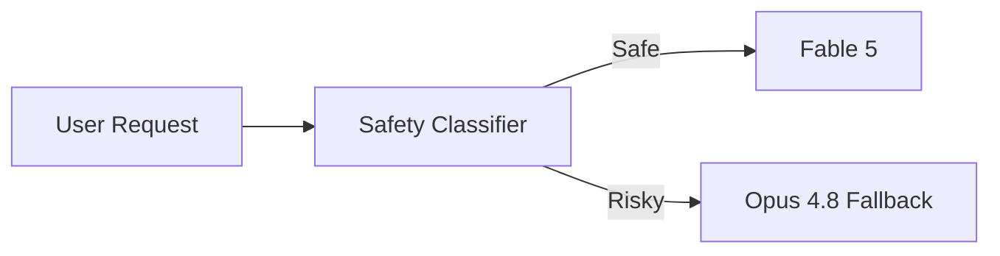

This architecture is one of Fable 5's most significant innovations.

---

## OpenAI's Approach

OpenAI primarily relies on:

- Alignment training
- Policy enforcement
- Safety tuning
- System-level controls

GPT-5.5 can refuse requests, but Anthropic's publicly described classifier-and-fallback architecture is more explicit and specialized. citeturn0search0turn0news18

---

## Google's Approach

Google similarly combines:

- Policy enforcement
- Safety tuning
- Moderation systems
- Content filtering

Gemini uses multiple safety layers, but public documentation does not describe the same classifier-triggered graceful fallback architecture used by Fable 5.

---

## Is Anthropic's Approach Better?

Not necessarily.

It is different.

### Advantages

- Better observability
- Structured intervention
- Reduced hard refusals
- More graceful user experience

### Disadvantages

- More system complexity
- Potential false positives
- Additional operational overhead

For enterprises, however, predictability often matters more than elegance.

This makes Anthropic's architecture particularly attractive in regulated environments.

---

# Model Selection Framework for Tekravio

## Recommended Deployment Matrix

| Tekravio Use Case | Recommended Model | Reason |
|-------------------|------------------|--------|
| AI Coding Agents | Fable 5 | Strongest documented coding performance |
| Repository Refactoring | Fable 5 | SWE-Bench leadership |
| Technical Documentation | Fable 5 | Knowledge-work strength |
| Research Assistant | GPT-5.5 or Fable 5 | Both strong |
| Google Workspace Automation | Gemini | Native ecosystem integration |
| Visual Document Processing | Fable 5 / Gemini | Both strong |
| Cost-Sensitive High Volume Workloads | Gemini | Lower cost profile |
| Reliability-Critical Outputs | Fable 5 | Strong benchmark performance |
| Multimodal Voice + Video | GPT-5.5 | Omnimodal capabilities |

---

# Honest Verdict

As of June 13, 2026, Fable 5 represents a strong choice for Tekravio's engineering workloads, subject to availability restrictions. Documented benchmark evidence (as of the June 9, 2026 launch) places it ahead of GPT-5.5 on software engineering tasks, repository-level coding, autonomous patch generation, and enterprise knowledge-work evaluations. For organizations building coding agents, technical copilots, internal engineering assistants, document-analysis systems, and research workflows, Fable 5 offers a compelling combination of capability and reliability. Its classifier-and-fallback architecture also provides a level of deployment transparency that many enterprises will find attractive.

However, Fable 5 is not the universal winner. GPT-5.5 remains highly competitive in scientific research workflows, terminal-centric development environments, and multimodal experiences involving audio and video. Gemini continues to be a strong option for organizations deeply invested in the Google ecosystem and for cost-sensitive deployments requiring large-scale multimodal productivity.

If Tekravio's primary objective is software engineering excellence, Fable 5 is the recommended choice based on publicly documented benchmarks (as of June 13, 2026); however, availability restrictions and access policies must be confirmed with Anthropic. If the objective is broad multimodal interaction or ecosystem integration, GPT-5.5 and Gemini may be better choices depending on the environment.

For Fable 5 to become the obvious default everywhere, Anthropic would need to match or exceed competitors in multimodal breadth, reduce data-retention constraints, lower costs, and continue demonstrating benchmark leadership across scientific and enterprise workloads—not just coding and knowledge work.

---


