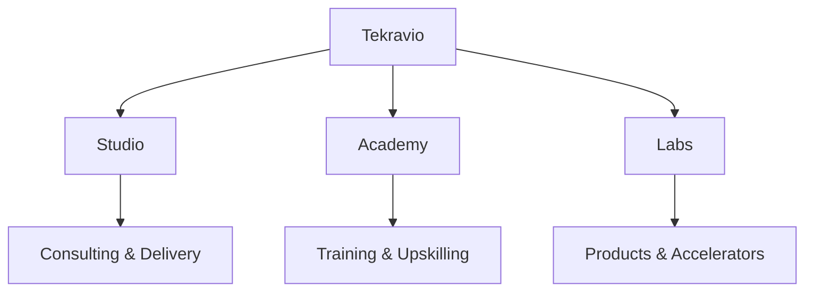
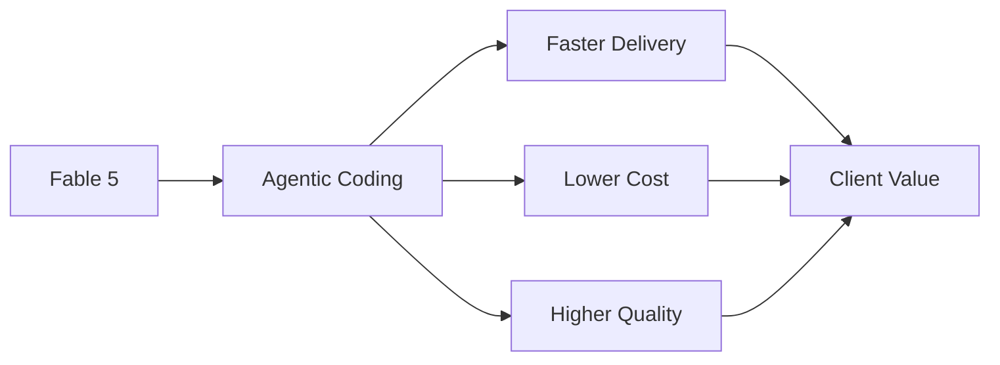
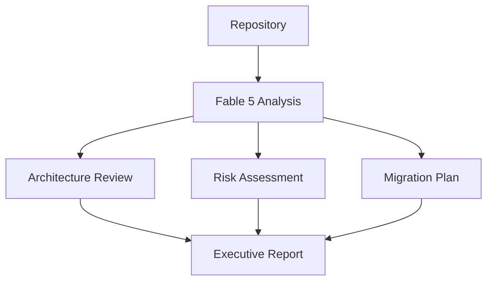
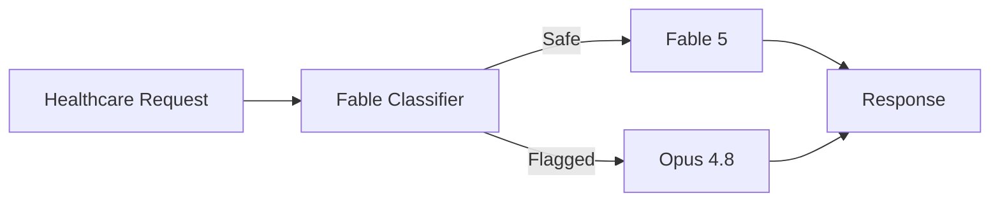

# Tekravio Use Case Map: Where Fable 5 and Mythos 5 Change Our Work

> Strategic analysis of how Anthropic's Mythos-class models can be applied across Tekravio Studio, Tekravio Academy, and Tekravio Labs.

**Prepared For:** Tekravio Leadership Team  
**Focus:** Business Impact, ROI, Product Strategy, Cost Modeling, and Risk Management

---

# Executive Summary

Tekravio operates across three business pillars: Studio (consulting and delivery), Academy (training and workforce development), and Labs (products and accelerators). The arrival of Fable 5 represents more than an incremental improvement over Opus 4.8. It enables workflows that combine stronger software engineering, longer reasoning chains, deeper document understanding, and more autonomous execution.

For Tekravio, the most important capability is not raw intelligence. It is the combination of:

- Agentic coding
- Long-horizon autonomy
- Enterprise knowledge work
- Multi-document reasoning

These capabilities directly affect how consultants deliver projects, how engineers are trained, and how new products are built.

The highest ROI opportunity across the entire organization is likely an AI-powered engineering mentor platform within Tekravio Academy. This use case can serve thousands of learners while reusing the same infrastructure across multiple technology stacks.

---

# Understanding Tekravio's Business Model

Based on Tekravio's public positioning, the company operates through three interconnected verticals.



The value of Fable 5 differs across each vertical.

---

# Tekravio Studio: Client Consulting

Studio delivers consulting and engineering services across healthcare, fintech, logistics, cloud, DevOps, and AI.

The question is:

**What becomes possible with Fable 5 that was difficult or uneconomical with Opus 4.8?**

---

## Healthcare

### Capability

Long-Horizon Knowledge Work

### Use Case

Clinical Workflow Analysis Assistant

Healthcare projects frequently involve:

- Regulatory requirements
- Process documentation
- Integration specifications
- Clinical workflows

A consultant may need to analyze hundreds of pages of requirements before proposing a solution.

Opus 4.8 could assist with individual documents.

Fable 5 can maintain context across larger reasoning chains and generate deeper cross-document analysis.

### Client Value

Instead of spending several days manually tracing relationships between systems, consultants can produce architecture recommendations faster.

Benefits:

- Faster project discovery
- Better documentation quality
- Reduced consulting effort
- Improved stakeholder communication

---

## Fintech

### Capability

Agentic Coding

### Use Case

Legacy Modernization Accelerator

Many fintech clients operate large codebases containing:

- Java systems
- Spring applications
- Monolith architectures
- Legacy APIs

Fable 5 can perform repository-scale analysis and propose coordinated changes across multiple components.

### Client Value

Consultants can accelerate:

- Refactoring
- Migration planning
- API modernization
- Cloud transformation

This reduces delivery timelines and lowers modernization costs.

---

## Logistics

### Capability

Long-Horizon Planning

### Use Case

Supply Chain Intelligence Assistant

Logistics projects often involve:

- Warehouse systems
- Route planning
- Inventory management
- ERP integrations

Fable 5 can analyze large operational datasets and documentation simultaneously.

### Client Value

The model can help identify:

- Bottlenecks
- Process inefficiencies
- Automation opportunities

This creates measurable business value for clients.

---

# Most Valuable Studio Capability

Among all capabilities, the most important unlock for Studio is:

## Agentic Coding

Why?

Consulting revenue is tied directly to engineering productivity.

Every improvement in:

- Development speed
- Refactoring quality
- Code review
- Migration planning

translates into faster delivery and higher margins.



For Studio, agentic coding creates the largest financial impact.

---

# Tekravio Academy

Academy trains engineers across multiple technology stacks.

This creates a unique opportunity because education scales differently from consulting.

One instructor can only mentor a limited number of students.

An AI mentor can scale almost infinitely.

---

## Use Case 1: Automated Assignment Evaluation

### Problem

Traditional evaluation focuses on:

- Compilation success
- Unit tests
- Manual reviews

This often misses real-world engineering concerns.

### Fable 5 Solution

Fable 5 can evaluate:

- Code quality
- Architecture
- Security
- Maintainability
- Scalability

### Student Experience

Instead of receiving:

> "Correct"

Students receive:

> "Correct, but this approach would create scaling problems under heavy load."

This mirrors real-world code review.

---

## Use Case 2: Mentor Simulation

### Problem

Students frequently lack access to experienced mentors.

### Solution

Fable 5 acts as:

- Senior engineer
- Solution architect
- Reviewer

Students can submit code and receive feedback comparable to professional review processes.

### Impact

Training becomes more practical and industry-oriented.

---

## Use Case 3: Personalized Curriculum Engine

### Problem

Most training programs follow fixed learning paths.

### Solution

Fable 5 analyzes:

- GitHub repositories
- Assignment history
- Skill gaps
- Career goals

and generates individualized learning plans.

### Example

Two Python learners may receive entirely different recommendations based on their strengths and weaknesses.

---

# Highest ROI Academy Use Case

The strongest opportunity is:

## AI Engineering Mentor Platform

Why?

Because it can be reused across:

- Java
- Python
- React
- Angular
- DevOps
- Cloud
- AI

Instead of creating separate mentoring systems, Tekravio can deploy one platform powered by Fable 5.

Benefits:

- Lower instructor load
- Higher student satisfaction
- Better completion rates
- Strong differentiation

This creates recurring value every day.

---

# Tekravio Labs

Labs focuses on products, accelerators, and reusable IP.

This is where Fable 5 becomes most interesting.

---

# Product Opportunities Enabled by Fable 5

## Building Block 1

### Repository Intelligence

Fable 5 excels at understanding large codebases.

This enables products that:

- Analyze repositories
- Generate modernization plans
- Recommend improvements

---

## Building Block 2

### Enterprise Knowledge Reasoning

Organizations store knowledge across:

- PDFs
- Wikis
- Documentation
- Tickets

Fable 5 can connect information across these sources.

---

## Building Block 3

### Long-Horizon Agent Workflows

Instead of answering a single question, Fable 5 can execute multi-step plans.

This enables automation products rather than simple chat interfaces.

---

# New Product Category

## Autonomous Modernization Architect

Before Fable 5, modernization analysis required extensive consulting effort.

A Labs product could:

1. Ingest repositories.
2. Analyze architecture.
3. Identify technical debt.
4. Generate migration plans.
5. Estimate effort.
6. Produce executive reports.



This product category becomes far more practical with Fable 5.

---

# Highest ROI Opportunity Across Tekravio

After evaluating Studio, Academy, and Labs, the strongest ROI appears to be:

## Academy AI Mentor Platform

Reason:

- Recurring usage
- Large user base
- Reusable infrastructure
- Cross-stack applicability

Studio projects create high value but are episodic.

Academy creates value continuously.

---

# Cost Model

Assume:

- 500 active learners
- 20 mentor interactions per day
- 1,000 input tokens
- 500 output tokens

## Daily Requests

```text
500 × 20
= 10,000 requests/day
```

## Monthly Requests

```text
10,000 × 30
= 300,000 requests/month
```

## Input Tokens

```text
300,000 × 1,000
= 300,000,000 tokens
```

Cost:

```text
300 × $10
= $3,000
```

## Output Tokens

```text
300,000 × 500
= 150,000,000 tokens
```

Cost:

```text
150 × $50
= $7,500
```

## Total Monthly Cost

```text
$3,000 + $7,500
= $10,500/month
```

### Interpretation

A platform serving hundreds of learners for roughly $10.5k per month can replace a substantial amount of manual mentoring effort.

---

# Classifier Risk for Healthcare Projects

One important risk involves Fable 5's biology and chemistry classifiers.

## Why It Matters

Healthcare projects often involve:

- Clinical research
- Drug information
- Medical terminology
- Scientific literature

Some requests may resemble the categories monitored by Mythos-class safety systems.

---

## Potential False Positive Scenario

A consultant asks:

> Analyze interactions between medical compounds and summarize potential risks.

The classifier may interpret the request as belonging to a protected scientific domain.

This could trigger:

- Refusal
- Fallback routing

even though the request is legitimate.

---

# Why the Fallback Architecture Helps

Anthropic designed Fable 5 to fall back to Opus 4.8 rather than simply fail.



This means users still receive assistance.

The experience is degraded less severely than a hard refusal.

---

# Mitigation Strategy

Tekravio should:

1. Log fallback events.
2. Monitor healthcare workloads.
3. Route scientific tasks through controlled workflows.
4. Maintain Opus fallback support.
5. Test representative client scenarios.

This ensures that legitimate healthcare projects continue functioning smoothly.

---

# Strategic Recommendations

## Studio

Primary Model:

**Fable 5**

Primary Benefit:

**Agentic Coding**

---

## Academy

Primary Model:

**Fable 5 API**

Primary Benefit:

**AI Mentor Platform**

---

## Labs

Primary Model:

**Fable 5**

Primary Benefit:

**Autonomous Modernization Products**

---

# Final Verdict

Fable 5 has the potential to create meaningful value across all three Tekravio verticals. For Studio, the largest opportunity comes from agentic coding and modernization consulting. For Academy, the highest-return opportunity is a reusable AI mentor platform capable of supporting engineers across multiple technology stacks. For Labs, the strongest opportunity lies in building products that combine repository intelligence, enterprise knowledge reasoning, and long-horizon autonomous workflows.

Among all identified opportunities, the Academy mentor platform appears to deliver the best balance of scalability, recurring value, and operational efficiency. It transforms expertise from a limited human resource into a reusable organizational asset.

For Tekravio, the question is not whether Fable 5 can improve operations. The question is which business unit should adopt it first. Based on the analysis, Academy offers the fastest path to measurable ROI, while Studio and Labs provide the largest long-term strategic upside.

---

# References

1. Tekravio Official Website.
2. Tekravio Services and Academy Information.
3. Anthropic Fable 5 Documentation.
4. Anthropic Mythos-Class Documentation.
5. Public Benchmark Reports for Fable 5.
